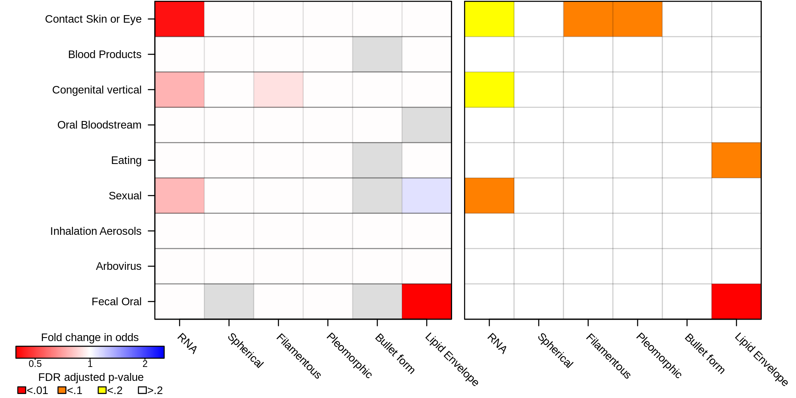

---
header-includes:
- \usepackage{pdflscape}
- \usepackage{colortbl}
- \usepackage{texshade}
- \newcommand{\blandscape}{\begin{landscape}}
- \newcommand{\elandscape}{\end{landscape}}
output: 
  pdf_document: 
    keep_tex: yes
    df_print: kable
---
# Viral structural traits and transmission mode analysis
Code and metadata for the paper "Linking virus structures to modes of transmission". This document can be regenerated by running:

```
make clean
make
```

in this directory. 

The code requires `R` and the `R` packages:
* `ggplot2`
* `knitr`
* `dplyr`
* `tidyr`
* `parallel`
* `ape`
* `phylolm`
* `phytools`


```{r setup, include=FALSE}
knitr::opts_chunk$set(echo = TRUE, warnings = FALSE, message = FALSE, warning = FALSE)
options(knitr.table.format = "latex") 
library(ggplot2)
library(dplyr)
library(tidyr)
library(ape)
library(phylolm)
library(parallel)
library(phytools)

####
# Replace with local project directory
####

transmissionVars <- c("Fecal.Oral","Arbovirus","Inhalation.Aerosols","Inhalation.Dust","Sexual","Eating","Oral.Bloodstream","Breastfeeding","Maternal.Fetal","Germ.line","Blood.Products","Contact.Skin.or.Eye")
attributeVars <- c("NucAcid","Spherical","Filamentous","Pleomorphic","Bullet.form","Lipid.Envelope")

data <- read.csv("Viral Transmission MetadataTblS1.csv",header = TRUE,stringsAsFactors=FALSE) %>% arrange(Common.Name)

data[,c(attributeVars,transmissionVars)]<-lapply(data[,c(attributeVars,transmissionVars)],function(xx)if(all(xx %in% 0:1))as.logical(xx) else xx)


transmissionCols <- which(colnames(data) %in% transmissionVars)
attributeCols <- which(colnames(data) %in% attributeVars)

```

```{r}
print(sessionInfo())
```


## Figure 1: Human viral traits and transmission modes
```{r humanHeatmap, echo=FALSE, eval=TRUE, results='asis', fig.height=9}

VariableLevels <- c(attributeVars, transmissionVars, "Baltimore.classification")
VariableCols <- which(colnames(data) %in% VariableLevels)

humanPlotData <- data %>%
  filter(Common.Name=="Human") %>%
  select(Virus.name, Virus.family, Virus.genus, VariableCols) %>%
  gather("Variable","Value", VariableLevels) %>%
  mutate(subject=ifelse(Variable=="Lipid.Envelope","Lipid",
                        ifelse(Variable %in% c("Spherical","Bullet.form","Filamentous", "Pleomorphic"),
                               "Capsid Structure",
                               ifelse(Variable %in% c("Baltimore.classification","Category"),"other",
                                      ifelse(Variable=="NucAcid","NucAcid","Transmission mode")))),
         color=ifelse(subject=="Lipid" & Value==TRUE,"red",
                      ifelse(subject=="Capsid Structure" & Value==TRUE, "blue",
                             ifelse(subject=="Transmission mode" & Value==TRUE,"green",
                                    ifelse(Value=="DNA","cyan",
                                           ifelse(Value=="RNA","yellow",
                                                  ifelse(subject=="other","white","black")))))),
         labelText=ifelse(subject %in% c("other","NucAcid"),Value,"")) %>%
  mutate(species=factor(Virus.name, levels = sort(unique(data$Virus.name), decreasing = TRUE))) %>%
  mutate(subject=factor(subject, levels = c("other","Capsid Structure","NucAcid","Lipid","Transmission mode"))) %>%
  mutate(Variable=factor(Variable, levels = VariableLevels))

humanPlotFamilyOrder <- humanPlotData %>% filter(Variable=="Baltimore.classification") %>% arrange(Value, Virus.family) %>% pull(Virus.family) %>% unique()

humanPlotData %>%
  mutate(Virus.family=factor(Virus.family, levels=humanPlotFamilyOrder)) %>%
  ggplot(aes(x=Variable,y=species, fill=color)) +
  geom_tile(aes(),color="black") +
  geom_text(aes(label = labelText), size = 1.5) +
  scale_fill_manual(values = c("red"="red", "blue"="blue","green"="green","light grey"="light grey","white"="white","cyan"="cyan","yellow"="yellow", "black"="black")) +
  xlab("") + ylab("") +
  facet_grid(Virus.family ~ subject, scales = "free", space = "free", switch="y") +
  theme(axis.text.y = element_blank(),
        axis.ticks.y = element_blank(),
        axis.text.x = element_text(size=6, angle=45, vjust = 1, hjust = 1),
        strip.text.y = element_text(angle=180, size=5, margin = margin(0,0,0,0, "cm")),
        strip.placement = "outside",
        strip.text.x = element_blank(),
        panel.spacing.y = unit(0.15, "lines"),
        panel.spacing.x = unit(-0.3, "lines"),
        panel.background = element_blank(),
        panel.grid.major = element_blank(),
        panel.grid.minor = element_blank(),
        legend.position = "none")


```

## Figure 2: Association of viral traits and transmission modes


