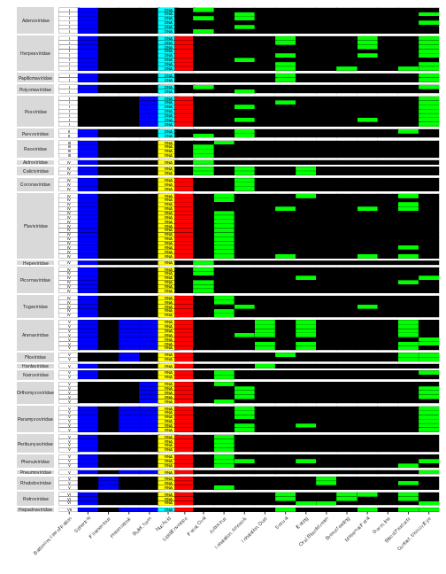
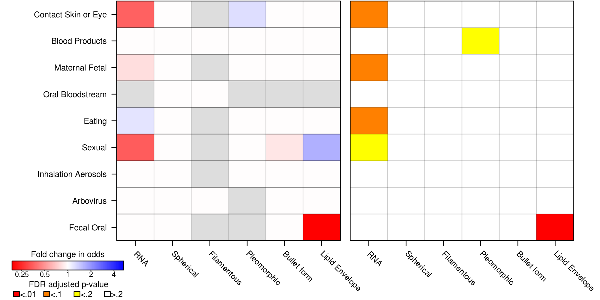

# Viral structural traits and transmission mode analysis
Code and metadata for the paper "Linking virus structures to modes of transmission". This document can be regenerated by running:

```
make
```

in this directory. Requires `R` and the `R` packages:
* `ggplot2`
* `knitr`
* `dplyr`
* `tidyr`
* `ape`
* `phylolm`
* `parallel`
* `phytools`


```r
print(sessionInfo())
```

```
## R version 3.4.4 (2018-03-15)
## Platform: x86_64-pc-linux-gnu (64-bit)
## Running under: Ubuntu 16.04.5 LTS
## 
## Matrix products: default
## BLAS: /usr/lib/libblas/libblas.so.3.6.0
## LAPACK: /usr/lib/lapack/liblapack.so.3.6.0
## 
## locale:
##  [1] LC_CTYPE=en_US.UTF-8       LC_NUMERIC=C              
##  [3] LC_TIME=en_US.UTF-8        LC_COLLATE=en_US.UTF-8    
##  [5] LC_MONETARY=en_US.UTF-8    LC_MESSAGES=en_US.UTF-8   
##  [7] LC_PAPER=en_US.UTF-8       LC_NAME=C                 
##  [9] LC_ADDRESS=C               LC_TELEPHONE=C            
## [11] LC_MEASUREMENT=en_US.UTF-8 LC_IDENTIFICATION=C       
## 
## attached base packages:
## [1] parallel  stats     graphics  grDevices utils     datasets  methods  
## [8] base     
## 
## other attached packages:
## [1] phytools_0.6-60 maps_3.3.0      phylolm_2.6     ape_5.2        
## [5] tidyr_0.8.1     dplyr_0.8.0.1   ggplot2_3.1.0  
## 
## loaded via a namespace (and not attached):
##  [1] Rcpp_1.0.0              pillar_1.3.1           
##  [3] compiler_3.4.4          plyr_1.8.4             
##  [5] tools_3.4.4             digest_0.6.15          
##  [7] evaluate_0.11           tibble_2.0.1           
##  [9] gtable_0.2.0            nlme_3.1-137           
## [11] lattice_0.20-38         pkgconfig_2.0.2        
## [13] rlang_0.3.1             fastmatch_1.1-0        
## [15] Matrix_1.2-14           igraph_1.2.2           
## [17] expm_0.999-3            coda_0.19-2            
## [19] withr_2.1.2             stringr_1.3.1          
## [21] knitr_1.20              globals_0.12.4         
## [23] combinat_0.0-8          scatterplot3d_0.3-41   
## [25] grid_3.4.4              tidyselect_0.2.5       
## [27] glue_1.3.0              listenv_0.7.0          
## [29] R6_2.2.2                plotrix_3.7-4          
## [31] future.apply_1.1.0      phangorn_2.4.0         
## [33] animation_2.6           purrr_0.2.5            
## [35] magrittr_1.5            MASS_7.3-50            
## [37] scales_0.5.0            codetools_0.2-15       
## [39] mnormt_1.5-5            assertthat_0.2.0       
## [41] future_1.11.1.1         colorspace_1.3-2       
## [43] numDeriv_2016.8-1       quadprog_1.5-5         
## [45] stringi_1.2.4           lazyeval_0.2.1         
## [47] munsell_0.5.0           clusterGeneration_1.3.4
## [49] crayon_1.3.4
```


## Figure 1: Human viral traits and transmission modes


## Figure 2: Association of viral traits and transmission modes


